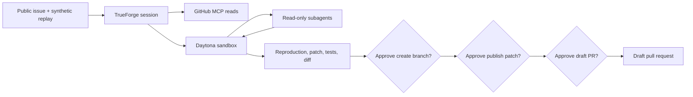

# ReplayFix Guarded

ReplayFix Guarded turns synthetic session-replay evidence into a reproduced, tested code fix—then pauses before every GitHub write. TrueForge owns the agent loop, isolated sandbox, subagents, durable session, MCP calls, and approval events. The workflow can create a topic branch, publish the tested patch, and open a **draft** pull request; it cannot merge.

Built from scratch for the 2026 Agent Harness Hackathon.

## Why it exists

Session replay can reveal a rage click or runtime error, but locating and safely fixing its cause still costs engineering time. Giving an agent unrestricted repository write access is not a safe shortcut. ReplayFix Guarded combines the useful parts of autonomy with a narrow authority boundary:

- deterministic replay-event validation, redaction, and issue detection;
- repository and issue reads through the official GitHub MCP server;
- reproduction, patching, and tests inside a disposable TrueForge/Daytona sandbox;
- investigator and regression-review subagents assigned read-only work;
- literal allowlists for GitHub tools; and
- separate TrueForge approval gates for branch creation, patch publication, and draft-PR creation.

## How the harness does the work



| Requirement           | Implementation                                                                                                                                               |
| --------------------- | ------------------------------------------------------------------------------------------------------------------------------------------------------------ |
| Real tool access      | Official remote GitHub MCP, restricted to eight named tools                                                                                                  |
| Safe code execution   | TrueForge provisions and reuses a Daytona sandbox for the session                                                                                            |
| Human control         | `create_branch`, `push_files`, and `create_pull_request` each emit an approval requirement                                                                   |
| Multi-agent work      | Dynamic subagents are instructed to perform read-only root-cause and regression-risk analysis; any attempted GitHub write still hits a harness approval gate |
| Visible state         | TrueForge events expose sandbox, thread, tool, approval, and terminal phases                                                                                 |
| Reconnectable session | TrueForge persists the session and turn event history; the UI can resume a paused run                                                                        |

See [the architecture](docs/ARCHITECTURE.md) and [security model](docs/SECURITY.md) for the full boundaries.

## Safety contract

ReplayFix Guarded accepts only a canonical `https://github.com/<owner>/<repo>/issues/<number>` URL whose repository appears in an exact allowlist. Demo evidence must be synthetic. Replay fields are validated at the boundary, identifiers are hashed, URL queries are removed, and common secret patterns are redacted before evidence is suitable for a model or log.

The agent receives only these GitHub tools:

```text
get_me             issue_read          get_file_contents
search_code        list_branches       create_branch       [approval]
push_files         [approval]          create_pull_request [approval]
```

There is no merge, auto-merge, delete, settings, release, or workflow-mutation tool. The system prompt requires a topic branch and `draft: true`; the product ends at a proposal for a maintainer to review. Protected-path and payload-bound policy utilities add defense in depth around the harness gates.

## Quick start

Requirements:

- Node.js 22.14 or newer;
- a configured model provider in TrueForge;
- a Daytona API key with sandbox/snapshot permissions; and
- a fine-grained GitHub token limited to the public demo repository, with only the contents and pull-request access needed by the MCP tools.

Install and run the local checks:

```bash
git clone https://github.com/sarvanithin/replayfix-guarded.git
cd replayfix-guarded
npm ci
npm run check
npm run analyze -- demo/session-replay.json
```

Start the matched TrueForge release in another terminal:

```bash
npm run trueforge
```

Copy `.env.example` to an untracked local environment file or export the values in your shell. Never commit it. After the first reviewed project commit is on `main`, set `REPLAYFIX_SKILL_REF` to that exact commit SHA; the skill is intentionally pinned instead of tracking a mutable branch.

Provision the GitHub MCP connector, Daytona provider, pinned skill, and saved agent once:

```bash
node --env-file=.env.local --import tsx src/cli/provision.ts --configure-connectors
```

If the connectors already exist, omit `--configure-connectors` so no credentials are replaced:

```bash
node --env-file=.env.local --import tsx src/cli/provision.ts
```

Run against an allowlisted public issue:

```bash
node --env-file=.env.local --import tsx src/cli/run.ts \
  https://github.com/sarvanithin/replayfix-guarded/issues/2
```

Open the local TrueForge UI to inspect subagent threads, sandbox commands, the diff, tests, and each pending tool call. The CLI reports approvals but intentionally cannot approve them; accept or deny the exact payload in TrueForge.

## Local development

| Command                        | Purpose                                                 |
| ------------------------------ | ------------------------------------------------------- |
| `npm run analyze -- <fixture>` | Validate, sanitize, and analyze a synthetic replay file |
| `npm run test`                 | Run the Vitest suite with coverage thresholds           |
| `npm run lint`                 | Run ESLint                                              |
| `npm run typecheck`            | Run strict TypeScript checks                            |
| `npm run build`                | Compile ESM output and declarations                     |
| `npm run check`                | Run formatting, lint, types, tests, and build           |

The committed fixture in [`demo/session-replay.json`](demo/session-replay.json) contains synthetic rage-click and runtime-error evidence. The tiny target in [`demo/target-app`](demo/target-app) deliberately contains the checkout behavior the live demonstration asks the agent to reproduce and repair in its sandbox.

## Three-minute demonstration

The recording should show one continuous run: public issue intake, sandbox reproduction, read-only tasks delegated to subagents, patch and passing checks, then three distinct approvals ending in a visibly draft PR. The product must never merge it. Follow [the timestamped demo script](docs/DEMO.md) and [submission checklist](docs/SUBMISSION_CHECKLIST.md).

## Qodo Code Review Evidence

This section will link the representative merged implementation PR after its Qodo review, engineering responses, follow-up review, and human merge are publicly complete. No direct push to `main` will be presented as reviewed work.

## Project provenance and AI assistance

An earlier personal project, **ReplayFix**, inspired only the broad idea of diagnosing UX defects from session replay. No source code, prompts, tests, assets, documentation, or commit history from that project were copied into this repository. ReplayFix Guarded is a new implementation centered on TrueForge sandbox execution, MCP least privilege, subagents, explicit approvals, validation, and testable policy boundaries.

AI tools assisted with requirements research, architecture, implementation, tests, and documentation. Human review owns the design and every merge; substantive changes go through public pull requests and Qodo review. See [the complete provenance and AI disclosure](docs/PROVENANCE.md).

## Documentation

- [Architecture](docs/ARCHITECTURE.md)
- [Security model](docs/SECURITY.md)
- [Provenance and AI disclosure](docs/PROVENANCE.md)
- [Demo script](docs/DEMO.md)
- [Submission checklist](docs/SUBMISSION_CHECKLIST.md)
- [Contributing](CONTRIBUTING.md)
- [Security policy](SECURITY.md)

## License

MIT. See [LICENSE](LICENSE).
