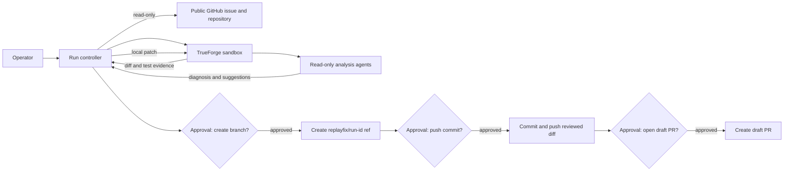
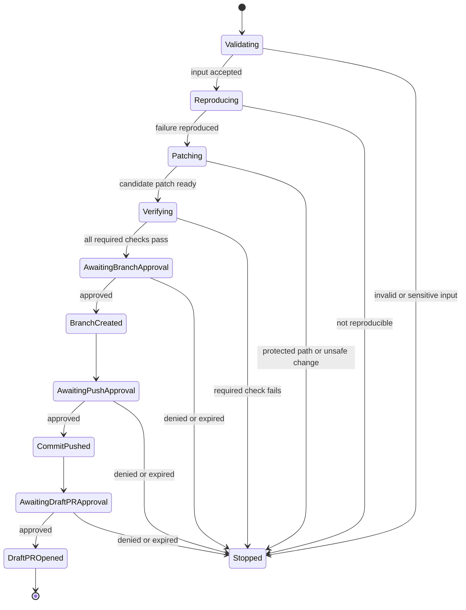

# Architecture

ReplayFix Guarded is an issue-to-draft-PR workflow with an intentionally narrow authority model. It reads a public GitHub issue and repository, performs all untrusted work in an isolated TrueForge sandbox, and exposes GitHub mutations as three separate human decisions.

## System boundary

GitHub reads may occur during intake and diagnosis. No GitHub write is available until the required test policy passes. A denial at any gate ends the run without attempting later writes.

## Components

### Run controller

TrueForge owns the state machine, tool loop, sandbox, subagent threads, and approval pauses. The saved agent validates the public issue URL, pins the base commit, delegates read-only tasks, checks path policy, runs verification, and assembles the evidence shown with each pending tool call.

### Read-only agents

Specialized agents may triage replay events, locate relevant source, propose a minimal correction, and review the resulting diff. TrueForge dynamic subagents currently share the parent tool surface, so their read-only role is an explicit instruction, not a separate capability boundary. The literal harness approval selectors remain the enforcement boundary for every available GitHub mutation, regardless of which thread requests it.

### TrueForge sandbox

Each run receives a disposable environment pinned to the recorded base SHA. Dependency installation must respect the existing lockfile. Reproduction, local patching, regression tests, broader tests, linting, and type checking occur here. Network and secret access should be disabled unless a documented fixture requires a narrowly scoped exception.

### Policy engine

The policy engine rejects sensitive paths, dependency changes, overly broad diffs, failed checks, stale base commits, non-synthetic evidence, and approval/payload mismatches. Its decision and version become part of the audit record.

### GitHub adapter

Use least-privilege GitHub/MCP operations. Separate read methods from three allow-listed writes: create a run branch, push one reviewed commit, and open one draft PR. Do not expose merge, auto-merge, force-push, release, settings, workflow, or default-branch mutation methods.

### Approval UI

Each gate displays the pending GitHub tool call and its exact arguments so a person can allow or deny that call. A changed action requires a new tool call and therefore another TrueForge approval. The included approval-digest library can additionally detect stale evidence bundles in a custom UI; the demo relies on TrueForge's native per-call gate.

## Run state machine

There is deliberately no merge state.

## Evidence model

Store append-only events for input validation, source reads, agent recommendations, sandbox commands, exit codes, diff hashes, policy decisions, and approvals. Redact secrets before persistence. The draft PR body should summarize the evidence and link to public artifacts when safe; it must not embed raw replay payloads.

Determinism matters more than autonomy: pin the base SHA and tool versions, use committed synthetic fixtures, and record every command needed to replay the demonstration.
